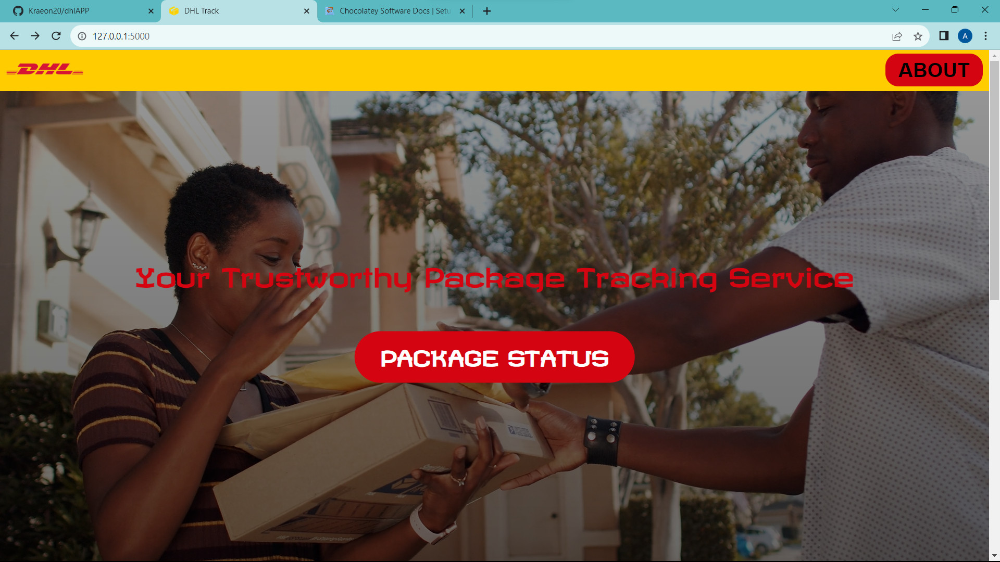
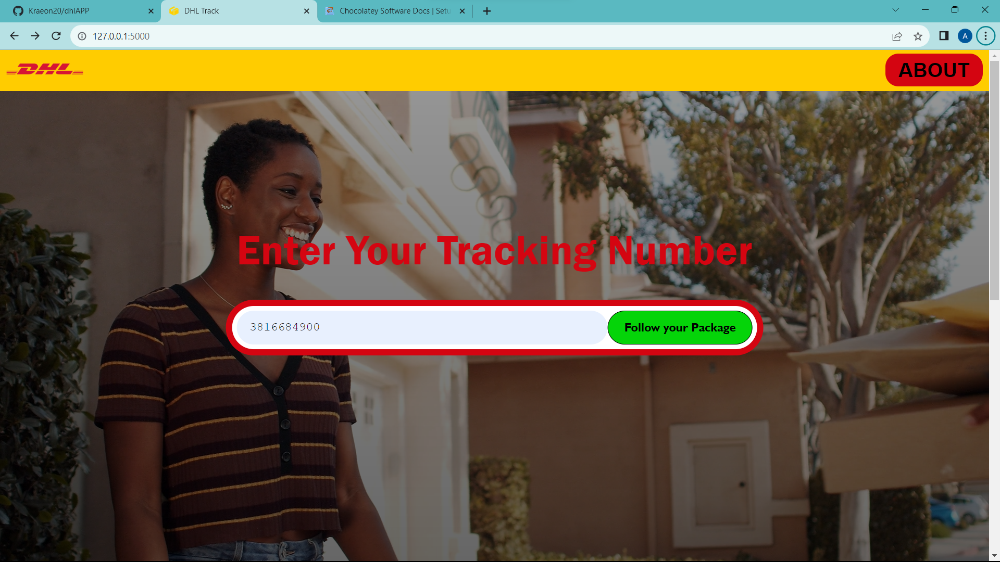
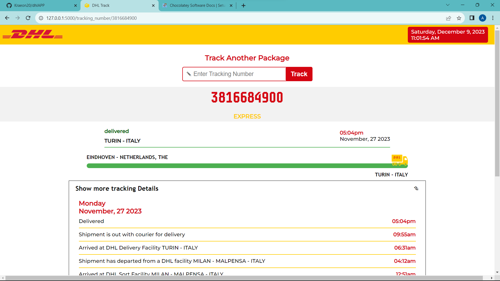
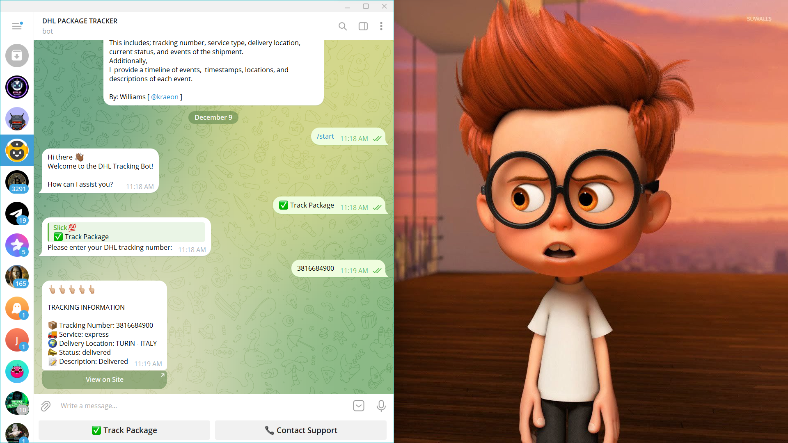

# DHL PACKAGE TRACKING

This is a project that uses the DHL API (Shipment Tracking - Unified) to provide the latest real-time information about shipment.
This includes; tracking number, service type, delivery location, current status, and events of the shipment.

The prject comes in two folds:
- Website
- Telegram Bot

## Table of Contents
- [Getting Started](#getting-started)
- [Installation](#installation)
- [Usage](#usage)
- [License](#license)

### Getting Started

clone this repository.

``git clone https://github.com/Kraeon20/dhlAPP.git``

### Installation

install requirements

``cd DHLAPP``

``pip install requirements.txt``

### Usage

  
  
    

  
  

### License

MIT License

I have hosted the bot. 
You can find it on telegram here: [<a href="https://t.me/dhl_package_tracker_bot" target="_blank">Telegram Bot</a>
]

Disclaimer: 

*I use pythonanywhere.com to host my bots. There are down times which will make the bots inactive (because I use the free version of PythonAnywhere)*

*So if at the time you want to check the bots out and they are inactive, kindly send me a message here or on telegram at [ @kraeon ]
And I will restart them. Thank you <3*